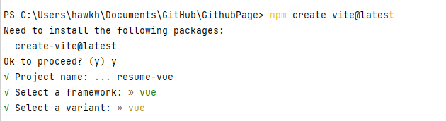
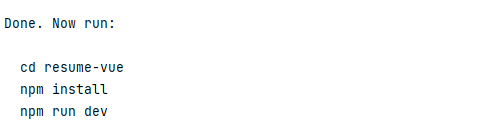
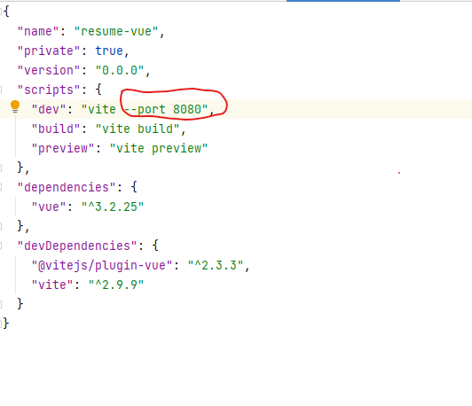
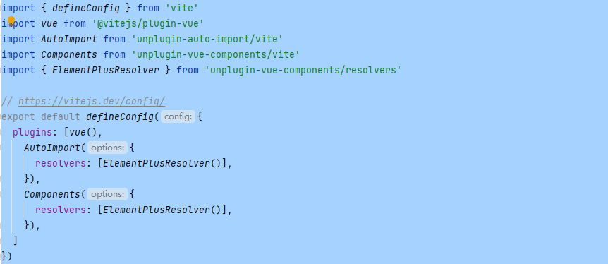

# Vue3+ElementPlus搭建个人简历网站
## vite环境搭建
1. 创建vite项目
在终端中使用以下命令行(将来的npm命令都在终端中进行)
~~~
npm create vite@latest
~~~

2. 启动项目
~~~
cd resume-vue
npm install
npm run dev
~~~

3. 改变开发端口(optional)

打开package.json文件,在“dev”配置项中添加--port XXXX(你想使用的端口号)

## 安装导入element-plus
1. 安装element-plus
~~~
npm install element-plus --save
~~~
2. 导入element-plus

在main.js中导入element-plus
~~~
//main.js
import {createApp} from 'vue'
import ElementPlus from 'element-plus'  //导入elementplus模块
import 'element-plus/dist/index.css'
import App from './App.vue'

createApp(App).use(ElementPlus).mount('#app') 
~~~

3. 安装按需导入插件
- 安装unplugin-vue-components和unplugin-auto-import插件
~~~
npm install -D unplugin-vue-components unplugin-auto-import
~~~
4. 在vite配置文件中插入以下代码
~~~
// vite.config.ts
import AutoImport from 'unplugin-auto-import/vite'
import Components from 'unplugin-vue-components/vite'
import { ElementPlusResolver } from 'unplugin-vue-components/resolvers'

export default {
  plugins: [
    // ...
    AutoImport({
      resolvers: [ElementPlusResolver()],
    }),
    Components({
      resolvers: [ElementPlusResolver()],
    }),
  ],
}
~~~

5. 